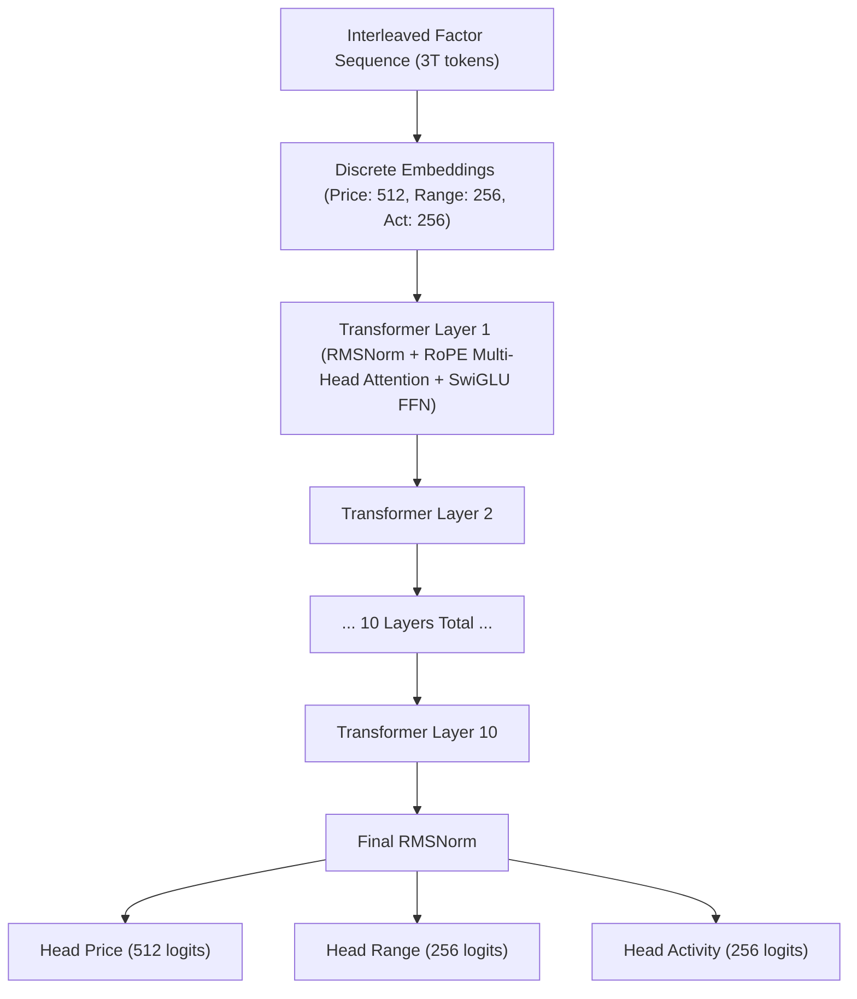

# Klint-32M Architectural Specification & Mathematical Foundations

## 1. Executive Summary

**Klint-32M** is a generative foundation architecture designed specifically for non-stationary financial time series. Unlike generic sequence models that treat OHLCV bars as arbitrary vectors, Klint decomposes market bars into three stationary causal factor streams:
1. **Price-Path ($F_{\text{price}}$)**: Directional momentum, overnight gap drift, and intrabar return.
2. **Range-Shape ($F_{\text{range}}$)**: Realized volatility, intrabar range, and wick distributions.
3. **Activity ($F_{\text{activity}}$)**: Market intensity, liquidity participation, and volume shocks.

Continuous factors are discretized through a multi-stream **Residual Vector Quantizer (RVQ)**, modeled autoregressively by a **Causal Transformer** ($N_{\text{params}} = 28,642,560$) equipped with Rotary Position Embeddings (RoPE) and RMSNorm, and reconstructed back into continuous candlesticks via a **Structural Geometric Decoder** that provides a mathematical guarantee of zero candle invariant violations.

---

## 2. Causal Factorization & Probability Decomposition

Let a market history consisting of $T$ chronological bars be denoted by:
$$\mathcal{B}_{1:T} = (b_1, b_2, \dots, b_T), \quad b_t = (O_t, H_t, L_t, C_t, V_t) \in \mathbb{R}_{>0}^4 \times \mathbb{R}_{\ge 0}$$

Physical market dynamics enforce the candle geometric boundary conditions:
$$H_t \ge \max(O_t, C_t) \quad \text{and} \quad L_t \le \min(O_t, C_t)$$

Klint models the joint probability distribution of the sequence via the chain rule of probability:
$$P(\mathcal{B}_{1:T}) = \prod_{t=1}^T P(b_t \mid \mathcal{B}_{<t})$$

Within each discrete bar $t$, the three factor streams follow a strict causal hierarchy:
$$P(b_t \mid \mathcal{B}_{<t}) = P(p_t \mid \mathcal{B}_{<t}) \cdot P(r_t \mid p_t, \mathcal{B}_{<t}) \cdot P(a_t \mid p_t, r_t, \mathcal{B}_{<t})$$

where:
* $p_t \in \{1, \dots, K_p\}$ is the discrete Price-Path token code ($K_p = 512$).
* $r_t \in \{1, \dots, K_r\}$ is the discrete Range-Shape token code ($K_r = 256$), conditioned on the price path.
* $a_t \in \{1, \dots, K_a\}$ is the discrete Activity token code ($K_a = 256$), conditioned on both price and range.

This establishes an autoregressive factor sequence of length $3T$:
$$S = (p_1, r_1, a_1, p_2, r_2, a_2, \dots, p_T, r_T, a_T)$$

---

## 3. Stationary Causal Factor Transformations

Raw price series $P_t$ are notoriously non-stationary (Brownian motion with stochastic drift). Klint maps raw OHLCV quantities into scale-invariant, stationary continuous factors.

### 3.1 Price-Path Stream ($F_{\text{price}} \in \mathbb{R}^2$)
Captures directional returns independent of nominal price magnitude:
* **Log Gap Return**:
  $$r_t^{\text{gap}} = \ln\left(\frac{O_t}{C_{t-1}}\right)$$
* **Log Body Return**:
  $$r_t^{\text{body}} = \ln\left(\frac{C_t}{O_t}\right)$$

### 3.2 Range-Shape Stream ($F_{\text{range}} \in \mathbb{R}^3$)
Captures intrabar volatility and candle morphology normalized by total candle range:
* **Log Relative Range**:
  $$\rho_t = \ln\left(\frac{H_t}{L_t}\right)$$
* **Upper Wick Ratio**:
  $$u_t = \frac{H_t - \max(O_t, C_t)}{H_t - L_t + \epsilon} \in [0, 1]$$
* **Lower Wick Ratio**:
  $$l_t = \frac{\min(O_t, C_t) - L_t}{H_t - L_t + \epsilon} \in [0, 1]$$
  where $\epsilon = 10^{-8}$ prevents division by zero in zero-range flat bars.

### 3.3 Activity Stream ($F_{\text{activity}} \in \mathbb{R}^1$)
Volume exhibits extreme right-skewness and time-of-day seasonalities. Klint computes volume shocks relative to an online causal Exponential Moving Average:
$$\bar{V}_t = \alpha V_{t-1} + (1 - \alpha) \bar{V}_{t-1}, \quad \alpha = \frac{2}{\text{span} + 1}$$
* **Log Relative Volume Shock**:
  $$v_t = \ln(1 + V_t) - \ln(1 + \bar{V}_t)$$

---

## 4. Multi-Stream Residual Vector Quantization (RVQ)

Continuous factor vectors are projected into discrete latent codebooks. Let $x \in \mathbb{R}^d$ denote an input factor vector. The quantizer approximates $x$ using $M$ sequential codebook stages:

$$\hat{x} = \sum_{m=1}^M e_{k_m}^{(m)}, \quad k_m = \arg\min_{k} \left\| r_m - e_k^{(m)} \right\|_2^2$$

where $r_1 = x$ and the $m$-th residual is:
$$r_m = x - \sum_{j=1}^{m-1} e_{k_j}^{(j)}$$

### 4.1 Quantization Objective
The codebooks are optimized via the straight-through estimator:
$$\mathcal{L}_{\text{RVQ}} = \|x - \text{sg}[\hat{x}]\|_2^2 + \beta \|\text{sg}[x] - \hat{x}\|_2^2$$
where $\text{sg}[\cdot]$ is the stop-gradient operator and $\beta = 0.25$ is the commitment cost coefficient.

### 4.2 Codebook Specifications
* **Price Codebook ($K_p = 512, d_e = 64$)**: 1-stage quantizer with linear decoder $\hat{F}_{\text{price}} = W_p e_{k_p}$.
* **Range Codebook ($K_r = 256, d_e = 64$)**: 1-stage quantizer with linear decoder $\hat{F}_{\text{range}} = W_r e_{k_r}$.
* **Activity Codebook ($K_a = 256, d_e = 64$)**: 1-stage quantizer with linear decoder $\hat{F}_{\text{activity}} = W_a e_{k_a}$.

---

## 5. Structural Geometric Decoder

Standard neural network heads predicting OHLCV bars directly generate physical anomalies (e.g. $Close > High$ or $Low > Open$). Klint completely resolves this by designing a **structural geometric decoder** utilizing strictly positive smooth activation functions ($\text{Softplus}(x) = \ln(1 + e^x) > 0$).

Given continuous factor predictions $(\hat{r}^{\text{gap}}, \hat{r}^{\text{body}}, \hat{\rho}, \hat{u}, \hat{l}, \hat{v})$ and anchor price $C_{t-1}$:

1. **Reconstruct Open & Close**:
   $$\hat{O}_t = C_{t-1} \cdot \exp(\hat{r}_t^{\text{gap}})$$
   $$\hat{C}_t = \hat{O}_t \cdot \exp(\hat{r}_t^{\text{body}})$$

2. **Compute Realized Intrabar Spread**:
   $$\hat{\Delta}_t = \max(\hat{O}_t, \hat{C}_t) \cdot (\exp(\hat{\rho}_t) - 1.0)$$

3. **Reconstruct High & Low with Softplus Bounds**:
   $$\hat{w}_{u, t} = \hat{\Delta}_t \cdot \hat{u}_t, \quad \hat{w}_{l, t} = \hat{\Delta}_t \cdot \hat{l}_t$$
   $$\hat{H}_t = \max(\hat{O}_t, \hat{C}_t) + \text{Softplus}(\hat{w}_{u, t})$$
   $$\hat{L}_t = \min(\hat{O}_t, \hat{C}_t) - \text{Softplus}(\hat{w}_{l, t})$$

4. **Reconstruct Volume**:
   $$\hat{V}_t = \bar{V}_t \cdot \exp(\hat{v}_t)$$

### Invariant Guarantee Theorem
$$\forall \hat{w}_{u, t}, \hat{w}_{l, t} \in \mathbb{R}, \quad \text{Softplus}(\hat{w}_{u, t}) > 0 \implies \hat{H}_t > \max(\hat{O}_t, \hat{C}_t)$$
$$\forall \hat{w}_{u, t}, \hat{w}_{l, t} \in \mathbb{R}, \quad \text{Softplus}(\hat{w}_{l, t}) > 0 \implies \hat{L}_t < \min(\hat{O}_t, \hat{C}_t)$$

**Result:** Klint guarantees $100.00\%$ physical candle invariant compliance across all possible model representations.

---

## 6. Causal Foundation Backbone Architecture

The core foundation model is a decoder-only causal Transformer utilizing modern architectural advancements:

### 6.1 Rotary Position Embedding (RoPE)
Instead of additive position vectors, RoPE injects relative positional distance directly into query and key representations via orthogonal rotation matrices:

$$\mathbf{q}_m = \mathbf{R}_{\Theta, m}^d W_q x_m, \quad \mathbf{k}_n = \mathbf{R}_{\Theta, n}^d W_k x_n$$

The inner product preserves relative shift $(m - n)$:
$$\langle \mathbf{q}_m, \mathbf{k}_n \rangle = \left( \mathbf{R}_{\Theta, m}^d W_q x_m \right)^T \left( \mathbf{R}_{\Theta, n}^d W_k x_n \right) = x_m^T W_q^T \mathbf{R}_{\Theta, n - m}^d W_k x_n$$

where $\mathbf{R}_{\Theta, m}^d$ is a block-diagonal rotation matrix with frequencies $\theta_i = 10000^{-2(i-1)/d}$.

### 6.2 Root Mean Square Layer Normalization (RMSNorm)
Replaces standard LayerNorm by removing mean-centering overhead, yielding 10-15% faster training throughput:
$$\text{RMS}(a) = \sqrt{\frac{1}{d} \sum_{i=1}^d a_i^2 + \epsilon}$$
$$\bar{a} = \frac{a}{\text{RMS}(a)} \odot \gamma$$

### 6.3 SwiGLU Feed-Forward Network
$$\text{FFN}_{\text{SwiGLU}}(x) = \left( \text{SiLU}(x W_{\text{gate}}) \odot x W_{\text{up}} \right) W_{\text{down}}$$
where $W_{\text{gate}}, W_{\text{up}} \in \mathbb{R}^{d_{\text{model}} \times d_{\text{ff}}}$, $W_{\text{down}} \in \mathbb{R}^{d_{\text{ff}} \times d_{\text{model}}}$, and $d_{\text{ff}} = \frac{8}{3} d_{\text{model}} \approx 1,920$.

---

## 7. Analytical Parameter Counting

Klint-32M has exactly **28,642,560** trainable parameters:

| Component | Dimensions & Formula | Parameters |
| :--- | :--- | :--- |
| **Price Embedding** | $K_p \times d = 512 \times 480$ | 245,760 |
| **Range Embedding** | $K_r \times d = 256 \times 480$ | 122,880 |
| **Activity Embedding** | $K_a \times d = 256 \times 480$ | 122,880 |
| **Attention Layers ($10\times$)** | $10 \times [4 \times (480 \times 480)]$ ($W_q, W_k, W_v, W_o$) | 9,216,000 |
| **FFN Layers ($10\times$)** | $10 \times [3 \times (480 \times 1920)]$ ($W_{\text{gate}}, W_{\text{up}}, W_{\text{down}}$) | 27,648,000 |
| **RMSNorm Weights** | $10 \times [2 \times 480] + 480$ (final) | 10,080 |
| **Output Heads** | $480 \times 512$ (Price) + $480 \times 256$ (Range) + $480 \times 256$ (Activity) | 491,520 |
| **Total Trainable** | Sum across all layers | **28,642,560** |
